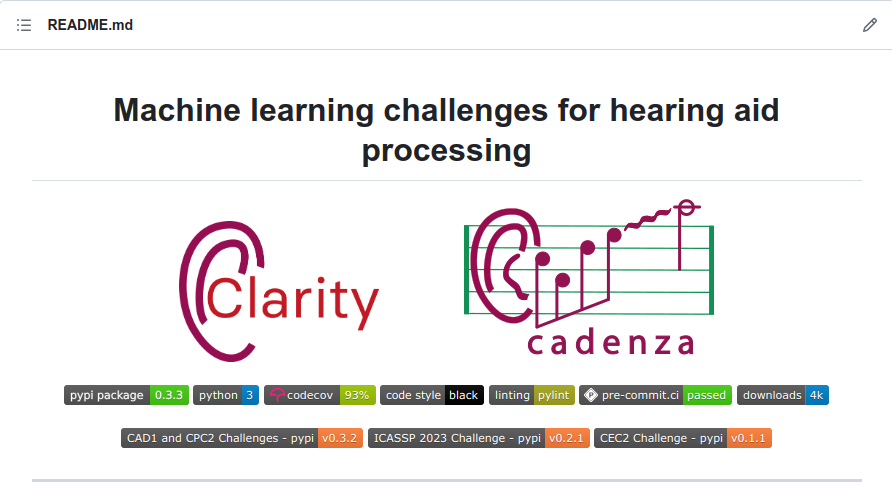

# The GitHub Tools

The aims of the Clarity and Cadenza projects are to stimulate progress in speech and music processing for people with hearing loss. The Clarity project aims to improve the intelligibility and quality of speech in noise, while the Cadenza project focuses on the perceived audio quality of music.

Both projects organize open machine learning challenges providing a scenario, datasets, tools, and baselines. Due to these similarities and the fact that both projects focus on hearing loss, they share the same code base.

The unified codebase allow us to:

1. Simplify the maintenance of common elements such as hearing aid prescriptions (e.g., NAL-R) and audiogram data structures.
2. It offers a single entry point for newcomers and for people who want to work on speech and/or music for people with a hearing loss.

## Clarity GitHub Repository

The Clarity and Cadenza challenges tools can be found in the Clarity GitHub repository.


## Clarity Module Installation

### PyPI

Clarity is available on the [Python Package Index (PyPI)](https://pypi.org/project/pyclarity) to install create and/or
activate a virtual environment and then use `pip` to install.

```bash
conda create --name clarity python=3.8
conda activate clarity

pip install pyclarity
```

### GitHub Cloning

```bash
# First clone the repo
git clone https://github.com/claritychallenge/clarity.git
cd clarity

# Second create & activate environment with conda, see https://docs.conda.io/projects/conda/en/latest/user-guide/install/index.html
conda create --name clarity python=3.8
conda activate clarity

# Last install with pip
pip install -e .
```

### GitHub pip install

Alternatively `pip` allows you to install packages from GitHub sources directly. The following will install the current
`main` branch.

```bash
pip install -e git+https://github.com/claritychallenge/clarity.git@main
```

## Note

The tools and recipes included in the <a href = 'https://github.com/claritychallenge/clarity'>clarity/cadenza challenge repository</a> have been designed so that they can be integrated into python scripts that entrants may use in order to generate custom datasets or to expand the default datasets using new audio or varying data creation parameters. However, for convenience, the baseline clarity tools can be accessed in the command line interface (CLI) via shell scripts.